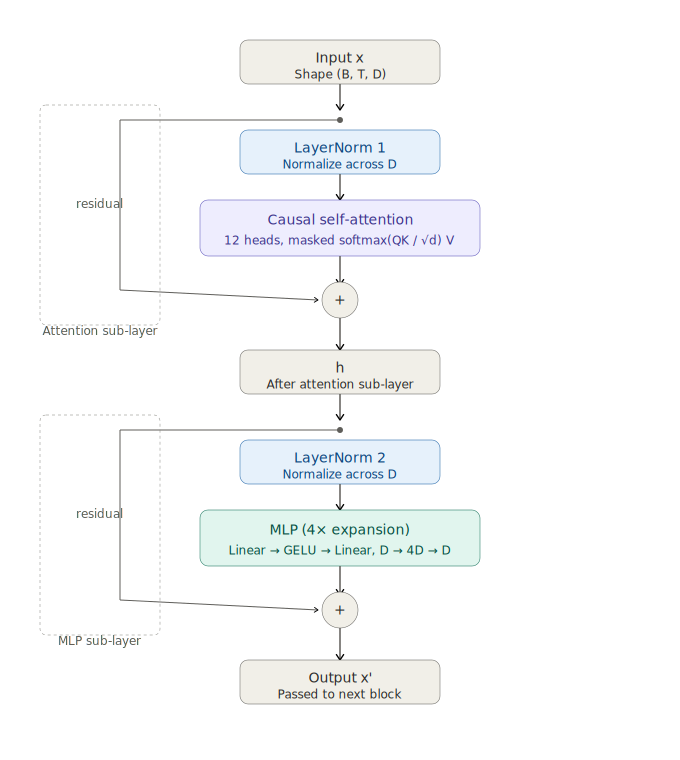
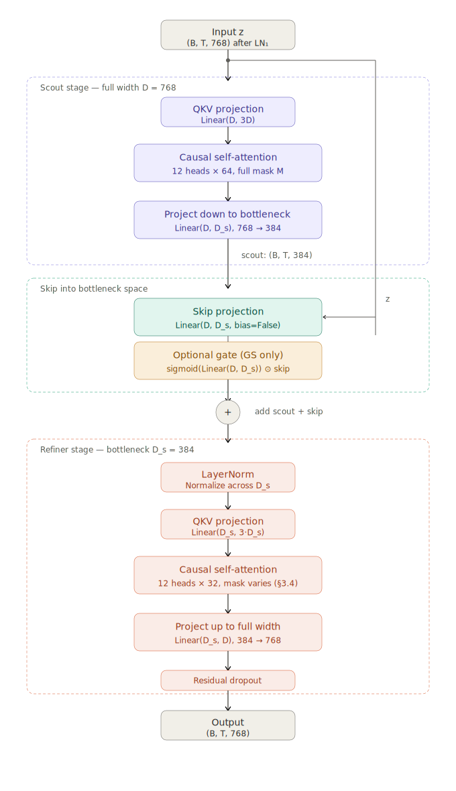
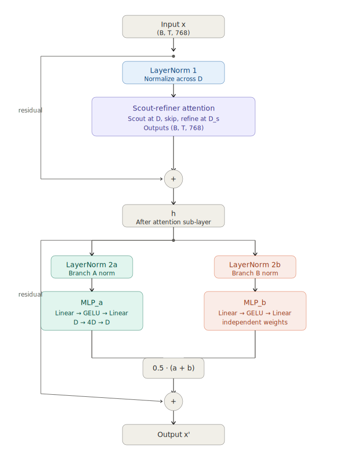
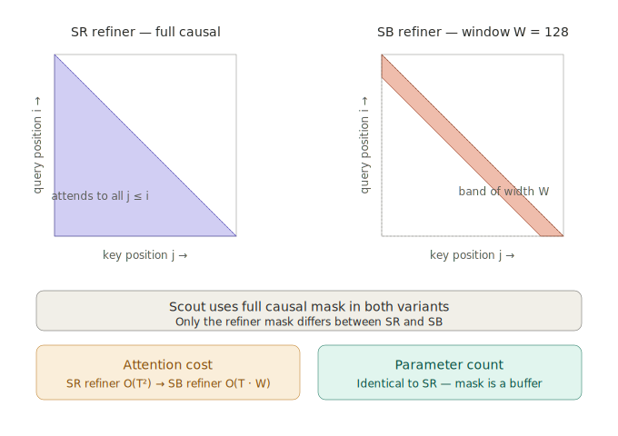
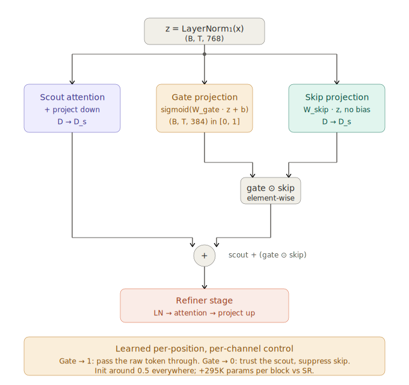
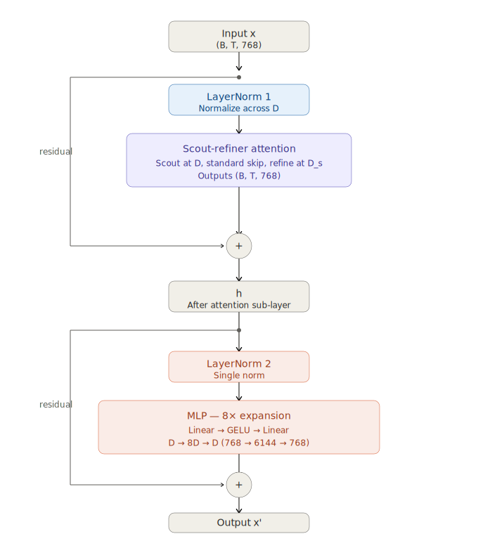

# The Scout-Refiner Bottleneck: A Negative Result with a Surprising Twist

*Epistemic status: negative results from a small-scale (~125M param) experiment. The architecture is genuinely novel. I did a Claude deep research survey before running it and found no prior work combining the specific ingredients. None of that helped. Sharing because I'd have wanted to read this post before starting.*

---

## TL;DR

I designed a two-stage attention module with a width bottleneck between the stages, expecting it to be more parameter-efficient than standard multi-head attention. At equal token budget, the baseline GPT-2 beats every variant I tried by 0.19–0.31 nats[^nats] (≈21–36% higher perplexity for the bottleneck variants). But the most interesting finding wasn't the headline failure. It was a crossover: **at short training budgets (under ~16M tokens), one of the bottleneck variants actually beats the baseline.** The baseline only wins if you train long enough.

This post covers what I tried, what failed, what the ablations told me, and the one surprising win.

[^nats]: A *nat* is the natural-log unit of cross-entropy loss, the same thing language model papers report as "loss." A model with cross-entropy `L` nats has perplexity `e^L`, so a gap of 0.2 nats means one model has roughly `e^0.2 ≈ 1.22×` the perplexity of the other (about 22% worse next-token prediction). For reference: GPT-2 small reports ~3.0 nats on WebText. (1 nat = 1/ln(2) ≈ 1.44 bits, if you prefer bits-per-token.)

---

## The Idea

Standard transformer attention is a single-stage process. Queries attend to all keys, you get a weighted sum of values, done. Every head sees the full embedding dimension; every token attends to every prior token. Here's the standard GPT-2 block for reference:



It works, but I wondered: what if attention could *refine* its own output?

I designed **Bottleneck Scout-Refiner Attention**, a two-stage causal self-attention module that replaces a single MHA block:



The **scout** does coarse global attention at full width (768-dim). Its output is projected *down* to a 384-dim bottleneck, where a learned skip projection from the original input is added back (to preserve token identity across the compression). The **refiner** does a second pass of attention at half width, then projects back up to 768.

The whole scout-refiner module sits inside a macro-block with two parallel MLP branches (averaged), and the model uses 6 macro-blocks instead of 12 standard blocks, roughly matching compute per forward pass:



The intuition: scout finds relevant positions globally, refiner integrates that summary with local context, and the bottleneck forces useful compression. A bit like how vision systems do coarse-to-fine processing, but inside a single attention module.

After a Claude deep research survey covering work from 2020–2025 (Longformer, BigBird, Reformer, Perceiver, Funnel Transformer, MLA, CCA, NSA, MEGABYTE, Nexus, and others), I found no prior work combining these specific ingredients: sequential two-stage causal self-attention + width bottleneck + learned skip projection in a single module. The closest neighbors are MLA (width bottleneck for KV cache, but single attention pass) and Nexus (two sequential attention stages, but no width bottleneck). The architecture appears genuinely novel.

It didn't help.

---

## Variants Tested

I ran three modifications of the base scout-refiner design to isolate which parts of the architecture were responsible for its behavior.

**Span-Bottleneck (SB)** restricts the refiner to a local window of 128 tokens. The scout still sees globally; only the refiner's mask changes:



**Gated Skip (GS)** replaces the rigid linear skip with a sigmoid-gated version. A learned gate `sigmoid(W_gate · z)` modulates the skip element-wise before it's added to the scout output:



**Single-MLP (SMLP)** collapses the two parallel 4× MLP branches into a single 8× MLP with the same total hidden capacity:



Summary of all five variants:

| Variant | Description | Params |
|---------|-------------|--------|
| **Baseline (BL)** | Standard GPT-2 (12 layers, 12 heads, 768-dim) | 124.4M |
| **Scout-Refiner (SR)** | 6 macro-blocks, dual 4× MLP | 114.7M |
| **Span-Bottleneck (SB)** | SR + refiner uses local window mask (128 tokens) | 114.7M |
| **Gated Skip (GS)** | `sigmoid(gate_proj(x)) * skip_proj(x)`, a learned gate | 116.5M |
| **Single-MLP (SMLP)** | One 8× MLP instead of dual 4× | 114.7M |

SB tests whether the refiner should look globally or locally. GS tests whether the rigid linear skip is the problem. SMLP tests whether averaging two parallel MLP branches helps or hurts.

---

## Experimental Setup

- **Dataset**: OpenWebText-style text (~46M tokens), GPT-2 tokenizer (50,257 vocab)
- **Block size**: 1024 tokens
- **Batch size**: 32 sequences (32,768 tokens/step), matched across all H200 runs
- **Hardware**: H200s (141GB) for the main comparison; V100 SXM2 (32GB) for the energy comparison
- **Optimizer**: AdamW, lr=3e-4
- **Max iterations**: 20,000 steps (data shown through step 3,000 where trend was clear)
- **Validation**: 1% held-out split, evaluated every 500 steps over 20 batches

All runs share the same data split and seed. The matched batch size matters: an earlier comparison had SB running at 2× the token throughput of SR/BL, which made it look much better than it was. Lesson noted.

---

## Headline Result: The Baseline Wins

Validation loss on H200 at batch size 32 (32K tokens/step):

| Step | SR | BL | Gap (SR − BL) |
|------|-----|----|--------------|
| 500  | 5.985 | 5.842 | +0.143 |
| 1000 | 5.096 | 4.866 | +0.230 |
| 1500 | 4.721 | 4.477 | +0.244 |
| 2000 | 4.496 | 4.225 | +0.271 |
| 2500 | 4.318 | 4.102 | +0.216 |
| 3000 | 4.197 | 3.933 | +0.264 |

(H200 W&B logs were deleted after the run; numbers above are from saved checkpoints. The V100 runs that the rest of this post relies on are fully public on [W&B](https://api.wandb.ai/links/padia-so-northeastern-university/fq8n082x), and the H200 results are reproducible from the same code.)

The baseline leads from step 500 onward and the gap is stable around 0.22–0.27 nats. There's no early "efficiency advantage" for the scout-refiner. The baseline just wins at equal token budget throughout.

Span-bottleneck (local-window refiner) was essentially indistinguishable from full-SR. The window mask doesn't help and doesn't hurt; the bottleneck architecture's failure is not about the refiner's attention pattern:

| Step | SB | vs SR |
|------|-----|-------|
| 500  | 5.926 | −0.059 |
| 1000 | 5.144 | +0.048 |
| 1500 | 4.695 | −0.026 |
| 2000 | 4.532 | +0.036 |
| 2500 | 4.354 | +0.036 |
| 3000 | 4.235 | +0.038 |

Final ranking at 3,000 steps (V100 batch=8, same trend, slightly different absolute numbers):

| Rank | Model | Val loss @ 3k steps | Gap vs BL |
|------|-------|---------------------|-----------|
| 1 | BL | 4.858 | — |
| 2 | **SMLP** | **5.045** | +0.187 |
| 3 | GS | 5.056 | +0.198 |
| 4 | SB | 5.169 | +0.311 |
| 5 | SR | 5.172 | +0.314 |

So the baseline wins, and the gap is large enough (≥0.19 nats) that I don't think it's noise.

---

## The Interesting Finding: Crossover at Short Budgets

This is the part I wasn't expecting. Looking at val loss as a function of *tokens consumed* (V100, batch=8):

| Model | 4M tokens | 8M tokens | 16M tokens | 24M tokens |
|-------|-----------|-----------|------------|------------|
| BL    | 6.172 | 5.989 | 5.413 | **4.858** |
| SMLP  | **6.051** | **5.769** | **5.393** | 5.045 |
| GS    | 6.195 | 5.896 | 5.535 | 5.056 |
| SB    | 6.135 | 5.890 | 5.526 | 5.169 |
| SR    | 6.134 | 5.959 | 5.488 | 5.172 |

SMLP leads the baseline at every checkpoint up to 16M tokens, and only falls behind in the 16M–24M window. The crossover happens around step 1500–2000. At 8M tokens (roughly 10 minutes of wall time on a V100), SMLP beats BL by 0.22 nats, a meaningful gap in the opposite direction from the headline result.

The energy picture tells the same story. Val loss at fixed energy budgets (Wh):

| Model | 50 Wh | 100 Wh | 150 Wh | 191 Wh |
|-------|-------|--------|--------|--------|
| BL    | 6.086 | 5.677  | 5.210  | **4.879** |
| SMLP  | **5.885** | **5.709** | **5.211** | — (runs out) |
| GS    | 6.034 | 5.678  | 5.337  | 5.074 |
| SB    | 5.997 | 5.623  | 5.359  | 5.171 |
| SR    | 6.035 | 5.751  | 5.350  | 5.172 |

And time/energy to hit specific loss thresholds:

| Model | loss=5.8 | loss=5.5 | loss=5.2 | loss=5.1 |
|-------|----------|----------|----------|----------|
| BL    | 17.5 min / 87 Wh | 24.8 min / 124 Wh | 30.1 min / 151 Wh | 31.5 min / 157 Wh |
| SMLP  | **11.9 min / 60 Wh** | **23.4 min / 117 Wh** | 30.3 min / 151 Wh | 34.6 min / 173 Wh |
| GS    | 16.0 min / 80 Wh | 26.7 min / 134 Wh | 33.0 min / 165 Wh | 37.2 min / 186 Wh |
| SB    | 15.1 min / 75 Wh | 26.3 min / 131 Wh | 36.6 min / 183 Wh | never |
| SR    | 18.9 min / 94 Wh | 25.2 min / 126 Wh | 36.8 min / 184 Wh | never |

SMLP reaches val_loss = 5.8 using 31% less energy than BL. It reaches 5.5 using 6% less. But to push below 5.1, only BL gets there in 3,000 steps.

Total learning rate (nats dropped per Wh, step 500 → 3000):

| Model | Loss drop | Energy | Nats/Wh |
|-------|-----------|--------|---------|
| BL    | 1.314 | 204 Wh | **0.00643** |
| GS    | 1.139 | 195 Wh | 0.00584 |
| SMLP  | 1.006 | 189 Wh | 0.00532 |
| SB    | 0.966 | 192 Wh | 0.00504 |
| SR    | 0.962 | 191 Wh | 0.00503 |

BL extracts more learning per watt over the full run. But it's partly because it starts from a higher loss at step 500, so BL has more room to fall.

**The takeaway**: if you're training a small model on a tight budget (quick iteration, ablation studies, compute-constrained settings) a bottleneck architecture with a single wide MLP could give you better results per dollar than a standard transformer. The baseline only pulls ahead if you can afford the longer run.

I don't know how far this generalizes. It might be a small-scale artifact that disappears at 1B+ params. It might be specific to OpenWebText. But the crossover is real and reproducible in my setup, and I haven't seen it discussed elsewhere.

---

## What the Ablations Said

Two of the design choices in the scout-refiner turned out to be actively hurting. The ablations made this surprisingly clean.

**The dual MLP was hurting.** SMLP (single 8× MLP) beats plain SR by 0.127 nats. The two parallel 4× MLP branches see the same input and have the same objective, so they probably partially collapse onto similar functions, and averaging the outputs is roughly equivalent to halving the gradient magnitude. This is the largest single improvement available within the scout-refiner family.

**The rigid skip was hurting too.** GS (sigmoid-gated skip) beats plain SR by 0.116 nats. The fixed linear `skip_proj(x)` adds the same function of x regardless of context, which is a blunt instrument. A sigmoid gate lets the model suppress the skip when the scout has already produced something useful.

**Both fixes touch the same problem.** They each recover ~0.12 nats independently, which suggests they're improving overlapping things: both let gradient information move more cleanly through the bottleneck. I didn't run a combined SMLP+GS variant because the gains probably don't stack, and they wouldn't close the remaining 0.19-nat gap to BL anyway.

**The bottleneck attention is the fundamental bottleneck** (sorry). Even SMLP, the best variant, with the dual-MLP issue fixed, still trails BL by 0.187 nats. The two-stage sequential attention with a 2× width reduction is the core problem, not the MLP structure or the skip design.

The most revealing data point was a training-curve pattern: SMLP's val loss was nearly flat between steps 1000 and 1500 (5.769 → 5.776) while BL dropped 0.33 nats in the same window. This stall-then-resume pattern appeared in every SR variant. Something about the bottleneck attention causes a local plateau that a standard transformer doesn't seem to hit.

---

## Why Did It Fail?

A few hypotheses, in roughly decreasing confidence:

**The bottleneck disrupts gradient flow.** Standard transformers have extremely clean gradient paths: each layer adds to a residual stream, gradients propagate through additions. In scout-refiner, errors from the refiner must traverse a 768→384→768 bottleneck before reaching the scout's QKV. The skip projection provides an alternate path, but apparently not a sufficient one. The training-curve plateau is consistent with this.

**Sequential attention is harder to train than parallel.** Standard attention is one step. Scout-refiner forces the network to do something useful in *two* sequential attention passes within a single block, with the second operating on a representation that's noisy early in training. One capable attention may be more sample-efficient than two weaker sequential ones.

**Fewer parameters at the same effective depth.** SR has 9.75M fewer params than BL. I don't think this is the main story (the gap is too large and too stable) but I didn't run a matched-parameter SR variant, and I should have. That's the obvious thing to do before publishing any architecture claim.

---

## What I'd Do Differently

Some takeaways that feel general beyond this specific architecture:

**Novelty of combination is not predictive of performance.** No prior paper combined these ingredients, but novel combinations of reasonable-sounding ideas are the default in architecture research. The ones that work are selected from a much larger set of failures that don't get written up. "It's novel" is a publication argument, not a quality argument.

**Ablate the cheap stuff first.** The dual-MLP hypothesis didn't get tested until after multiple full runs. A 500-step ablation would have taken ten minutes and told me to drop dual-MLP from the design.

**Match parameters from day one.** My initial SR-vs-BL comparison was confounded by a 9.75M-param gap. I still think the architecture is the main problem, but I can't fully separate "the bottleneck hurts" from "having fewer parameters hurts" without a matched run.

**Watch the training curves, not just the endpoints.** The mid-training plateau was the most informative signal in the whole experiment. If I'd been looking at curves earlier, I might have caught the bottleneck issue at step 1500 instead of step 3000.

**Negative results have a shape.** This isn't "the architecture is broken." It's "the architecture has a specific failure mode (bottleneck plateau) that costs ~0.2 nats at long training but gives ~0.2 nats back at short training." That shape might be useful to someone designing for a different point on the compute/quality curve.

---

## Status and Reproducibility

All five variants ran to 3,000 steps on V100; SR, BL, and SB also ran to 3,000+ steps at b32 on H200. No further runs are planned. I've spent the budget I had for this idea.

The full implementation is at [github.com/soham-padia/minGPT](https://github.com/soham-padia/minGPT), and the V100 training runs (which the ablation analysis is based on) are public on [W&B](https://api.wandb.ai/links/padia-so-northeastern-university/fq8n082x). The H200 logs were deleted after the run, but the numbers in the headline table are reproducible from the same code. The key files are `mingpt/model.py` (containing `BottleneckScoutRefinerAttention` and `HalfScoutRefinerParallelMLPBlock`), `base_transformer.py` (training script), and `slurm/train_gpt2_explorer.sbatch` (launcher). To reproduce a run:

```bash
sbatch --export=ALL,\
  MODEL_TYPE=gpt2-half-scout-refiner,\
  BATCH_SIZE=32,MAX_ITERS=20000 \
  slurm/train_gpt2_explorer.sbatch
```

Swap `MODEL_TYPE=gpt2` for the baseline.

---

*If you've seen a similar architecture work (sequential two-stage attention with a width bottleneck, in any setting) I'd genuinely like to know. My deep research survey didn't turn up this specific combination, but it could easily have missed something, and the plateau pattern is interesting enough that I'd like to understand whether anyone's solved it.*